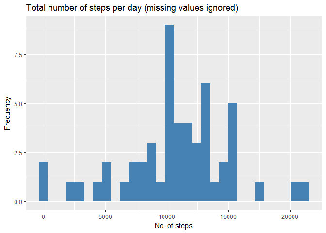
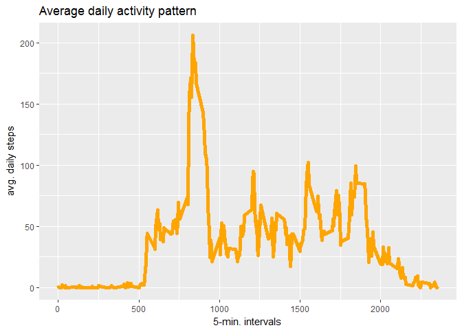
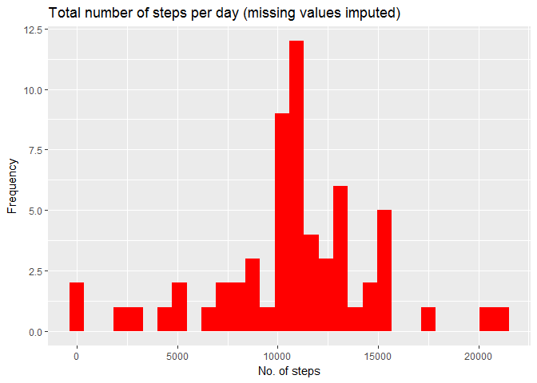
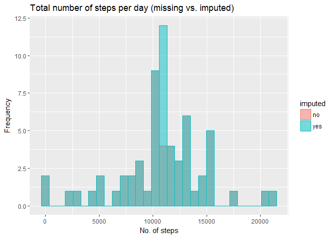
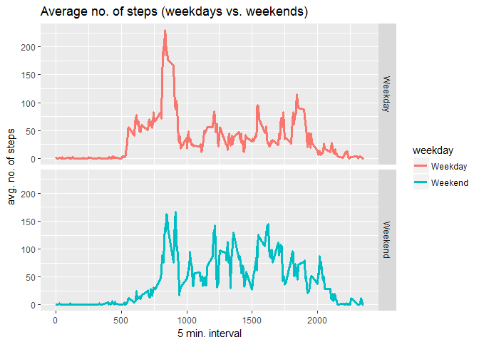

# Reproducible Research - Course Project 1
Yannis Moros  
June, 2017  

# Introduction

It is now possible to collect a large amount of data about personal movement
using activity monitoring devices such as a Fitbit, Nike Fuelband, or Jawbone
Up. These type of devices are part of the "quantified self" movement - a group
of enthusiasts who take measurements about themselves regularly to improve
their health, to find patterns in their behavior, or because they are tech geeks.
But these data remain under-utilized both because the raw data are hard to
obtain and there is a lack of statistical methods and software for processing and
interpreting the data.


This assignment makes use of data from a personal activity monitoring device.
This device collects data at 5 minute intervals through out the day. The data
consists of two months of data from an anonymous individual collected during
the months of October and November, 2012 and include the number of steps
taken in 5 minute intervals each day.

# Data
The data for this assignment can be downloaded from the course web site:

* Dataset: [Activity monitoring data](https://d396qusza40orc.cloudfront.net/repdata%2Fdata%2Factivity.zip) [52K]

The variables included in this dataset are:

* **steps**: Number of steps taking in a 5-minute interval (missing
    values are coded as NA)

* **date**: The date on which the measurement was taken in YYYY-MM-DD
    format

* **interval**: Identifier for the 5-minute interval in which
    measurement was taken

The dataset is stored in a comma-separated-value (CSV) file and there are a total of 17,568 observations in this dataset.

## Setup
1. Set knitr options

```r
knitr::opts_chunk$set(echo = TRUE, warning = FALSE, message = FALSE)
```

2. Specify required R packages

```r
require(ggplot2)
```


## Loading and preprocessing the data

1. Load the data


```r
# Assume working directory is set to the directory containing the project files.

if(!file.exists("./activity.csv")) {
        unzip("./activity.zip")    
}
A <- read.csv("activity.csv")
```

2. Process/transform the data into a format suitable for analysis

```r
A$date <- as.Date(A$date)
```

## What is mean total number of steps taken per day?

1. Make a histogram of the total number of steps taken each day

```r
A_day_tot <- aggregate(steps ~ date, A, sum)
g <- ggplot(data = A_day_tot, aes(A_day_tot$steps))
g + geom_histogram(fill = "steel blue") + xlab("No. of steps") + ylab("Frequency") + 
        ggtitle("Total number of steps per day (missing values ignored)")
```

<!-- -->

2. Calculate and report the **mean** and **median** total number of steps taken per day

```r
mean(A_day_tot$steps)
```

```
## [1] 10766.19
```

```r
median(A_day_tot$steps)
```

```
## [1] 10765
```

## What is the average daily activity pattern?

1. Make a time series plot (i.e. type = "l") of the 5-minute interval (x-axis)
and the average number of steps taken, averaged across all days (y-axis)

```r
A_int_means <- aggregate(steps ~ interval, A, mean)
g <- ggplot(data = A_int_means, aes(A_int_means$interval, A_int_means$steps))
g + geom_line(color = "orange", size = 2) + xlab("5-min. intervals") + ylab("avg. daily steps") + 
        ggtitle("Average daily activity pattern")
```

<!-- -->

2. Which 5-minute interval, on average across all the days in the dataset,
contains the maximum number of steps?


```r
A_int_means[which.max(A_int_means$steps), ]
```

```
##     interval    steps
## 104      835 206.1698
```

## Imputing missing values

Note that there are a number of days/intervals where there are missing values
(coded as NA). The presence of missing days may introduce bias into some
calculations or summaries of the data.

1. Calculate and report the total number of missing values in the dataset


```r
sum(is.na(A))
```

```
## [1] 2304
```

2. Devise a strategy for filling in all of the missing values in the dataset. The
strategy does not need to be sophisticated. For example, you could use
the mean/median for that day, or the mean for that 5-minute interval, etc.

Missing values for a given 5-min. interval are replaced with the mean value for
that interval.

3. Create a new dataset that is equal to the original dataset but with the
missing data filled in.


```r
# merge the full data set with the one holding mean interval steps
# first change the col name to avoid duplication
colnames(A_int_means) <- c("interval", "mean.steps")
A_merged <- merge(A, A_int_means, by = "interval")

# if a row contains NA steps, replace it with the mean steps, for that interval
A_imputed <- A_merged
for(i in 1:nrow(A_imputed)){
        if (is.na(A_imputed[i, "steps"])){
                A_imputed[i, "steps"] <- A_imputed[i, "mean.steps"]
        }
}

# remove the "mean.steps" column and round the number of steps
A_imputed <- A_imputed[, !(names(A_imputed) == "mean.steps")]
A_imputed$steps <- round(A_imputed$steps)
```

4. Make a histogram of the total number of steps taken each day and Calculate
and report the mean and median total number of steps taken per day. Do
these values differ from the estimates from the first part of the assignment?
What is the impact of imputing missing data on the estimates of the total
daily number of steps?


```r
A_imp_day_tot <- aggregate(steps ~ date, A_imputed, sum)
g <- ggplot(data = A_imp_day_tot, aes(A_imp_day_tot$steps))
g + geom_histogram(fill = "red") + xlab("No. of steps") + ylab("Frequency") + 
        ggtitle("Total number of steps per day (missing values imputed)")
```

<!-- -->

```r
mean(A_imp_day_tot$steps)
```

```
## [1] 10765.64
```

```r
median(A_imp_day_tot$steps)
```

```
## [1] 10762
```

Impact of imputing missing data:

```r
# calculate differences in mean and median
mean(A_imp_day_tot$steps) - mean(A_day_tot$steps)
```

```
## [1] -0.549335
```

```r
median(A_imp_day_tot$steps) - median(A_day_tot$steps)
```

```
## [1] -3
```

Considering that these numbers refer to total steps per day, and that rounding 
took place, the impact on the mean and median is practically 0.


```r
# create matrix A_diff which has both imputed and not imputed steps (row-bound)
# first add an additional column to both aggregate matrices - imputed:yes/no
A_day_tot$imputed <- "no"
A_imp_day_tot$imputed <- "yes"
A_diff <- rbind(A_day_tot, A_imp_day_tot)


# now plot the 2 histograms on top of each other to visualize the differences
ggplot(A_diff, aes(steps, fill = imputed, col = imputed)) + 
        geom_histogram(alpha = 0.5, position = "identity") + 
        xlab("No. of steps") + ylab("Frequency") + 
        ggtitle("Total number of steps per day (missing vs. imputed)")
```

<!-- -->

As seen in the histogram, after imputing NAs, more days have a total number of steps
equal to the mean (~10765), which makes sense considering the inputation method.

## Are there differences in activity patterns between weekdays and weekends?

For this part the weekdays() function may be of some help here. Use the dataset
with the filled-in missing values for this part.

1. Create a new factor variable in the dataset with two levels - "weekday"
and "weekend" indicating whether a given date is a weekday or weekend
day.


```r
for (i in 1:nrow(A_imputed)) {
        if(weekdays(A_imputed[i, "date"]) %in% c("Saturday", "Sunday")) {
                A_imputed[i, "weekday"] <- "Weekend"
        }
        else {
                A_imputed[i, "weekday"] <- "Weekday"
        }
}
```

2. Make a panel plot containing a time series plot (i.e. type = "l") of the
5-minute interval (x-axis) and the average number of steps taken, averaged
across all weekday days or weekend days (y-axis). The plot should look
something like the following, which was creating using simulated data:
Your plot will look different from the one above because you will be using
the activity monitor data. Note that the above plot was made using the lattice
system but you can make the same version of the plot using any plotting system
you choose.


```r
A_int_means_weekday <- aggregate(steps ~ weekday + interval, data = A_imputed, mean)

ggplot(A_int_means_weekday, aes(interval, steps, col = weekday)) + geom_line(size = 1.2) + 
        facet_grid(weekday ~ .) + xlab("5 min. interval") + ylab("avg. no. of steps") + 
        ggtitle("Average no. of steps (weekdays vs. weekends)")
```

<!-- -->


